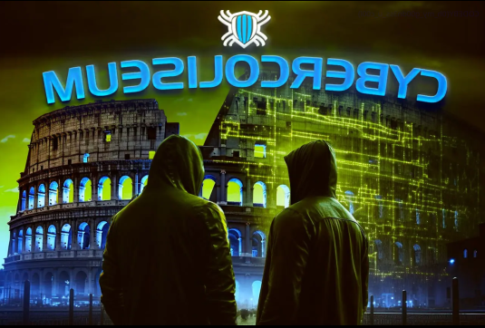
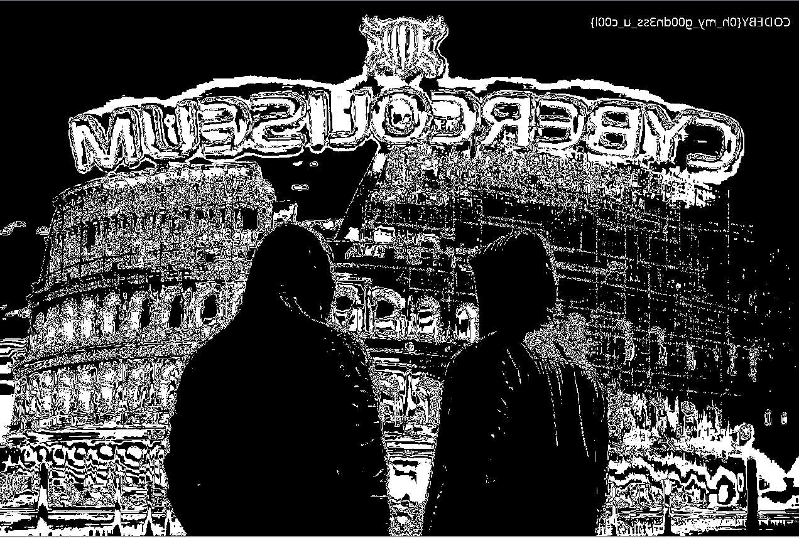

# 2023 Write-Up for CyberColiseum

### Challenge: RGB

- Download the file and open it, I see it is a txt file consisting of at most many lines of the form: (x, y): a, b, c
  (you can see it on file RGB.txt)
   + x, y : the coordinates of the pixel
   + a,b,c : the corresponding color code
- I realized that combining them would create a complete picture, using Python code :
  ```python
  from PIL import Image
  import numpy as np

  # Read data from file
  with open('1280x853.txt', 'r') as f:
     lines = f.readlines()

  # Convert data to a list of sets of coordinates and colors
  data = []
  for line in lines:
       parts = line.strip().split(':')
       coords = tuple(map(int, parts[0].strip('()').split(',')))
       color = tuple(map(int, parts[1].strip('()').split(',')))
       data.append((coords, color))
  
  # Create a numpy array to store image data
  image_data = np.zeros((1280, 853, 3), dtype=np.uint8)
  
  # Fill data into the array
  for item in data:
       coords, color = item
       x, y = coords
       image_data[x, y] = color
  
  # Create an image from the data
  img = Image.fromarray(image_data)
  
  # Save Image
  img.save('output.png')

and we got a png: 



- Use "stegsolve" to see hidden in it, we got flag : 



->flag: CODEBY{0h_my_g00dn3ss_u_c00l}
