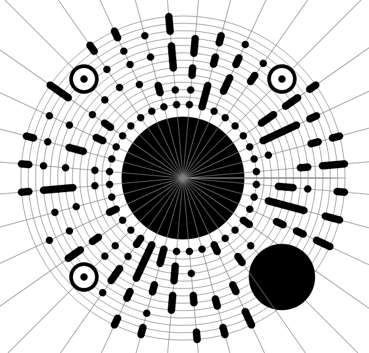

## 4. ZeChat (Misc)

- 
- This was honestly one of the hardest challenges I've ever done. Only 7 teams solved this challenge, not including my team. I spent up to 8 hours solving this challenge by hand, including reading the article. You can read [Chivato's article](https://hackmd.io/@Chivato/SkN3Piyan) to solve this problem.
  The binary string that I execute is:

   `01001001 01001110 010101000 10010010 1000111 01010010 01001001 01010100 010010 0101111011 0111011100 1100110110 0011011010 0000110100 0011011101 0111110110 0100001101 0000110111 0011010001 0111110011 0011011011 1001 1000110011 0000011 001 0000110001 0110111000 1101100101 1111011001 1001110100 01 11011100 1000010010 0001001000 0101111101`

  -> Flag : INTIGRITI{w3ch47_d474_3nc0d1n6_ftw!!!}
  
