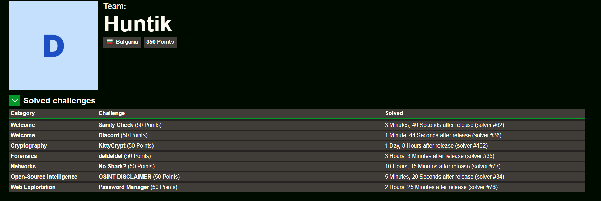

# IrisCTF - 2025

## Standings

## Challenges

| Category    | Huntik Writeup   | Solves | Technique // Unintended Solution | Alternative Writeup   |
| ----------- | ---------------  | ------ | ------------ | ---------------- | 
| Cryptography   | [KittyCrypt](challenges/Cryptography/KittyCrypt/)    |    200     |      |           
| Cryptography   | [knutsacque](challenges/Cryptography/knutsacque/)   |   64      |       |  [Author](https://github.com/Seraphin-/ctf/blob/master/2025/irisctf/knutsacque.md)
| Cryptography   | [AYES](challenges/Cryptography/AYES/)    |    34     |            |  [Author](https://github.com/Seraphin-/ctf/blob/master/2025/irisctf/ayes.md)
| Cryptography   | [SPHINCS5e](challenges/Cryptography/SPHINCS5/)    |   1      |      |  [Author](https://github.com/Seraphin-/ctf/blob/master/2025/irisctf/sphincs5.md) 
| Forensics   | [deldeldel](challenges/Forensics/deldeldel/)    |    241     |            |           
| Forensics   | [Tracem 1](challenges/Forensics/Tracem-1/)    |  50       |    |           
| Forensics   | [Windy Day](challenges/Forensics/Windy-Day/)    |   41      |     |           
| Forensics   | [Tracem 2](challenges/Forensics/Tracem-2/)    |   31      |         |   [Tracem 2](https://stefanin.com/posts/irisctf-tracem2/)
| Forensics   | [RIP Art](challenges/Forensics/RIP-Art/)    |   21      |         |        
| Pwn   | [sqlate](challenges/Pwn/sqlate/)    |   166      |         |
| Pwn   | [Checksumz](challenges/Pwn/Checksumz/)    |   39      |         |
| Pwn   | [MyFiles](challenges/Pwn/MyFiles/)    |   36      |         |
| Misc   | [O_WRONLY](challenges/Misc/O-WRONLY/)    |   63      |         |
| Misc   | [Cobra's Den](challenges/Misc/Cobra's-Den/)    |   116      |         |
| Misc   | [DΔς](challenges/Misc/DΔς/)    |   12      |         | [Dac](https://yun.ng/c/ctf/2025-iris-ctf/misc/dac)
| Misc   | [warden](challenges/Misc/warden/)    |   4      |         |  [Author](https://github.com/Seraphin-/ctf/blob/master/2025/irisctf/warden.md)
| Misc   | [prime5](challenges/Misc/prime5/)    |   0      |         |  [Author](https://github.com/Seraphin-/ctf/blob/master/2025/irisctf/prime5.md)
| Networks   | [No Shark?](challenges/Networks/No-Shark?/)    |   194      |         |
| Networks   | [Inferno Barrier](challenges/Networks/Inferno-Barrier/)    |   66      |         |
| Networks   | [Shake My Hand](challenges/Networks/Shake-My-Hand/)    |   62      |         |
| Networks   | [NetHog](challenges/Networks/NetHog/)    |  3      |         |
| OSINT   | [Checking Out of Winter](challenges/OSINT/Checking-Out-of-Winter/)    |  354      |         |
| OSINT   | [Sleuths and Sweets](challenges/OSINT/Sleuths-and-Sweets/)    |  232      |         |
| OSINT   | [Not Eelaborate](challenges/OSINT/Not-Eelaborate/)    |  187      |         |
| OSINT   | [Late Night Bite](challenges/OSINT/Late-Night-Bite/)    |  116      |         |
| OSINT   | [fuel deal](challenges/OSINT/fuel-deal/)    |  157      |         |
| OSINT   | [where's bobby](challenges/OSINT/where's-bobby/)    |  75      |         |
| OSINT   | [where's bobby 2](challenges/OSINT/where's-bobby-2/)    |  104      |         |
| Radio   | [dotdotdot](challenges/Radio/dotdotdot/)    |  150      |         |
| Radio   | [RFoIP](challenges/Radio/RFoIP/)    |  56      |         |
| Radio   | [SineFM](challenges/Radio/SineFM/)    |  26      |         |
| Radio   | [dotdotdot](challenges/Radio/Spicy-Messaging-Sinusoids/)    |  2      |         |
| Rev   | [Now this will run on my 486?](challenges/rev/Now-this-will-run-on-my-486?/)    |  102      |         |
| Rev   | [Crispy Kelp](challenges/rev/Crispy-Kelp/)    |  47      |         |
| Rev   | [bunny jumper!](challenges/rev/bunny-jumper!/)    |  25      |         |
| Rev   | [????????](challenges/rev/????????/)    |  7      |         |
| Rev   | [rev lifetime](challenges/rev/rev-lifetime/)    |  9      |         |  [Author](https://github.com/Seraphin-/ctf/blob/master/2025/irisctf/revlifetime.md) 
| Web   | [Password Manager](challenges/rev/Password-Manager/)    |  357      |         | [Password Manager](https://tsuruyu.gitbook.io/tsuryus-ctf-writeups/irisctf-2025/web/password-manager-baby)
| Web   | [Political](challenges/rev/Political/)    |  152      |         |  [Author](https://github.com/Seraphin-/ctf/blob/master/2025/irisctf/political.md) 
| Web   | [Bad Todo](challenges/rev/Bad-Todo/)    |  75      |         | [Bad Todo](https://rph.space/blog/irisctf-2025-bad-todo/)
| Web   | [webwebhookhook](challenges/rev/webwebhookhook/)    |  16      |         |  [Author](https://github.com/Seraphin-/ctf/blob/master/2025/irisctf/webwebhookhook.md) 

