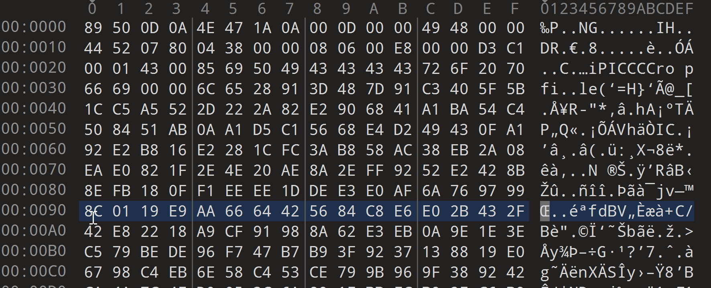
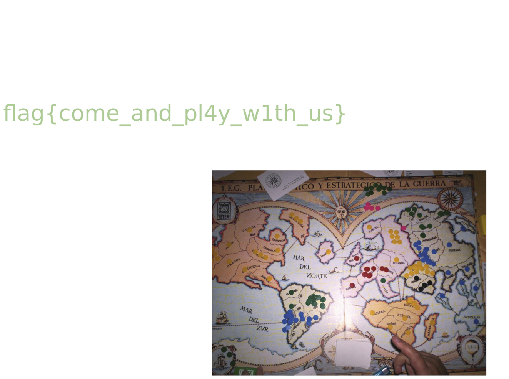

# 3st stage MetaRed CTF Argentina  | CERTUNLP 2023

 ## Shuffle - Forensics

- *I joined this tournament around October 25th when I hadn't participated in Huntik yet.
But I hope to be able to get accepted to WU for it here. Thanks everyone.*

- The challenge gives me a file in PNG format, but I can't open it. Use `hexedit` to check its data bits.

- 
 
- Comparing with a standard PNG file, we see the following: every 12 bytes will be 1 block, divide it into 3 blocks, each block consists of 4 bytes, and the error here is that the next 2 bytes of block 1 will be 2 bytes. the beginning of the second block, that is, the last 2 bytes and the first 2 bytes of blocks 1 and 2 are swapped.
And we see that in the third block, the first and last two will change places.
Just like that until the end of the hex file.
- I'm not really good at Python so I asked Bing to handle this :
  ```python
  def fix_file(file_name):
    with open(file_name, 'rb') as f:
        data = f.read()

    fixed_data = bytearray()
    for i in range(0, len(data), 12):
        block = data[i:i+12]
        if len(block) == 12:
            block1 = block[0:4]
            block2 = block[4:8]
            block3 = block[8:12]

            # Swap the last two bytes of block1 with the first two bytes of block2
            block1, block2 = bytearray(
                block1[0:2] + block2[0:2]), bytearray(block1[2:4] + block2[2:4])

            # Swap the first two bytes of block3 with its last two bytes
            block3 = bytearray(block3[2:4] + block3[0:2])

            fixed_data += block1 + block2 + block3
        else:
            fixeddata += block

    with open('fixed' + file_name, 'wb') as f:
        f.write(fixed_data)


    fix_file('challenge_file_name')
- Open it again and we got the flag :
  - 

