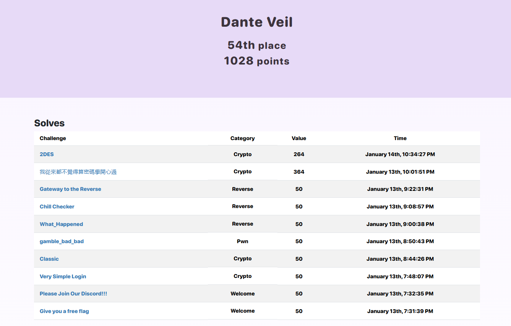

# TSCCTF - 2025

## Standings

## Challenges

| Category    | Huntik Writeup   | Solves | Technique // Unintended Solution | Alternative Writeup   |
| ----------- | ---------------  | ------ | ------------ | ---------------- | 
| Cryptography   | [Very Simple Login](challenges/Cryptography/Very-Simple-Login/)    |    144     |   // Challenge was broken.You could register and login as Admin directly and get the flag   |           
| Cryptography   | [Classic](challenges/Cryptography/Classic/)   |   130      |  Modular Arithmetics.You could easily bruteforce to find the correct character.     |  
| Cryptography   | [2DES](challenges/Cryptography/2DES/)    |    30     |     DES Semi Weak Keys       |  [Maple](https://blog.maple3142.net/2025/01/16/tscctf-2025-writeups/#crypto)
| Cryptography   | [我從來都不覺得算密碼學開心過](challenges/Cryptography/我從來都不覺得算密碼學開心過/)    |   23      |      |  [Maple](https://blog.maple3142.net/2025/01/16/tscctf-2025-writeups/#crypto) 
| Cryptography   | [AES Encryption Oracle](challenges/Cryptography/AES-Encryption-Oracle/)    |   16      |      |  [Maple](https://blog.maple3142.net/2025/01/16/tscctf-2025-writeups/#crypto) 
| Cryptography   | [Random Strange Algorithm](challenges/Cryptography/Random-Strange-Algorithm/)    |   9      |      |  [Maple](https://blog.maple3142.net/2025/01/16/tscctf-2025-writeups/#crypto) 
| Cryptography   | [Random Strangeeeeee Algorithm](challenges/Cryptography/Random-Strangeeeeee-Algorithm/)    |   8      |      |  [Maple](https://blog.maple3142.net/2025/01/16/tscctf-2025-writeups/#crypto) 
| Cryptography   | [Random Shuffle](challenges/Cryptography/Random-Shuffle/)    |   8      |      |  [Maple](https://blog.maple3142.net/2025/01/16/tscctf-2025-writeups/#crypto) 
