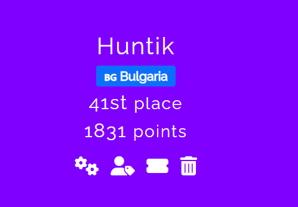

# WargamesMy - 2024

## Standings

## Challenges

| Category    | Challenge Link   | Solves | Technique // Unintended Solution    | Huntik Writeup   | Alternative Writeup   |
| ----------- | ---------------  | ------ | ------------ | ---------------- | ---------------------- |
| Cryptography   | [Credentials](challenges/Cryptography/Credentials/)    |    120     |   ROT cipher   |           |
| Cryptography   | [Rick'S Algorithm](challenges/Cryptography/Rick-S-Algorithm/)   |   24      |   Modular Arithmetics   |  |
| Cryptography   | [Hohoho 3](challenges/Cryptography/Hohoho-3/)    |    18     |            |  |
| Cryptography   | [Hohoho 3 continue](challenges/Cryptography/Hohoho-3-continue/)    |   13      |      |  |
| Cryptography   | [Rick'S Algorithm 2](challenges/Cryptography/Rick-S-Algorithm-2/)  | 8        |    GCD and RSA Broadcast Attack       |  |
| Forensics   | [I Cant Manipulate People](challenges/Forensics/I-Cant-Manipulate-People/)    |    220     |   Extract ICMP data         |           |
| Forensics   | [Unwanted Meow](challenges/Forensics/Unwanted-Meow/)    |  63       |   Remove unnecessary bytes from image |           |
| Forensics   | [Oh Man](challenges/Forensics/Oh-Man/)    |   36      |  Crack NTLM with Hashcat , Decode SMB3 in Wireshark , Fix minidump signature with script from [nanodump](https://github.com/fortra/nanodump) and parse with pypykatz   |           |
| Forensics   | [Tricky Malware](challenges/Forensics/Tricky-Malware/)    |   22      |     // Find the pastebin in the DUMP containing the flag       |           |
