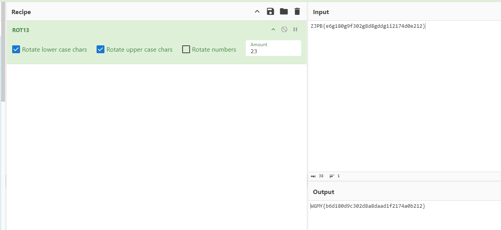

# Credentials

## Description

We found a leak of a blackmarket website's login credentials. Can you find the password of the user osman and successfully decrypt it?

Author: Alhfs

## Hint
The first user in user.txt corresponds to the first password in passwords.txt

## Files

* [Leak_stuff](files/Leak_stuff.rar)
## Solution

This is more of a warmup challenge.
Although initially it looks like you are given hashes to crack , a better look at the given list of passwords can show that there are a few in plaintext looking similar to the flag format.
After 2-3 tries one in particular catches the eye :

**ZJPB{e6g180g9f302g8d8gddg1i2174d0e212}**

We can immediately recognize that this awfully looks like the flag with some ROT.
Putting this in Cyberchef quickly confirms it so we get the flag.

