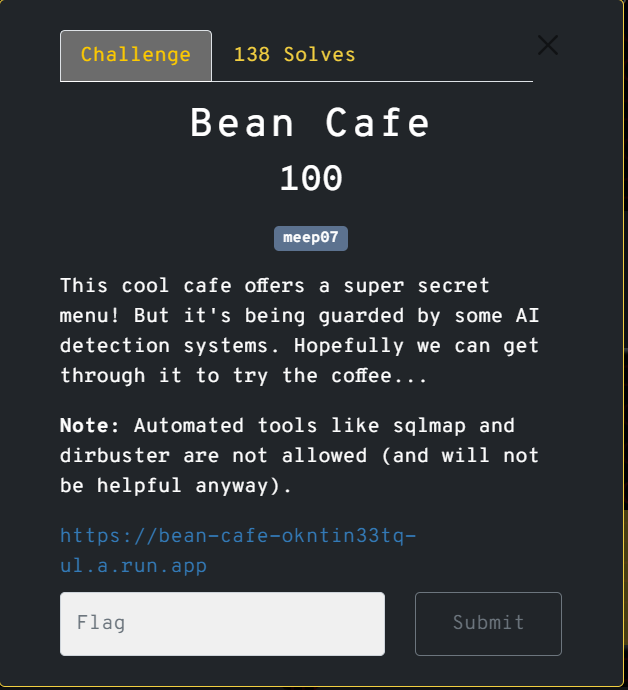
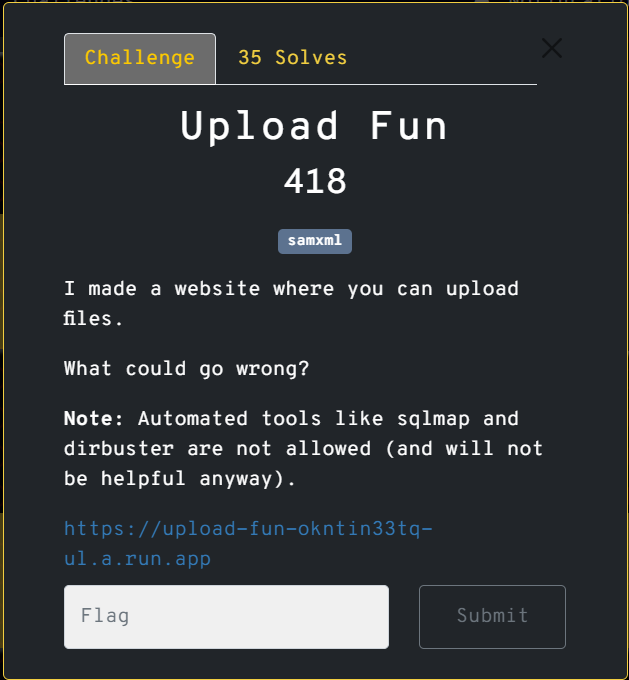
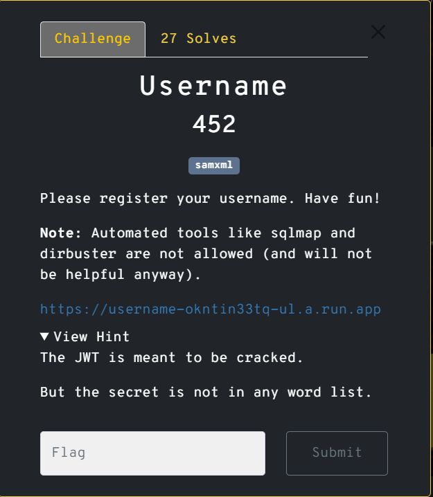
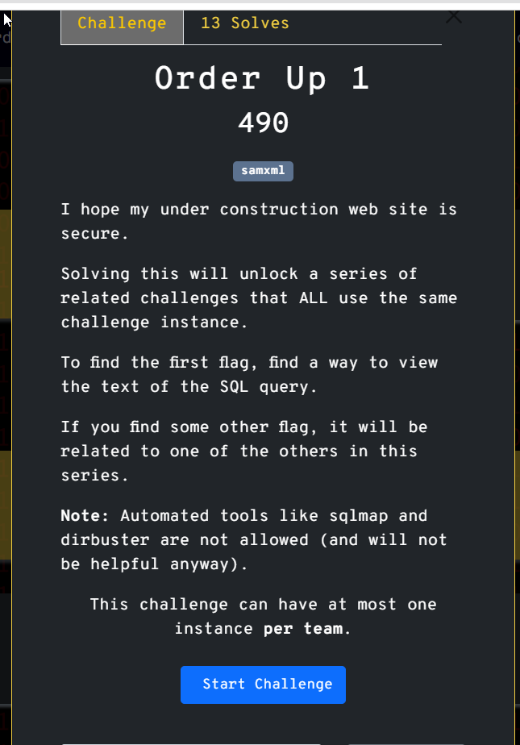
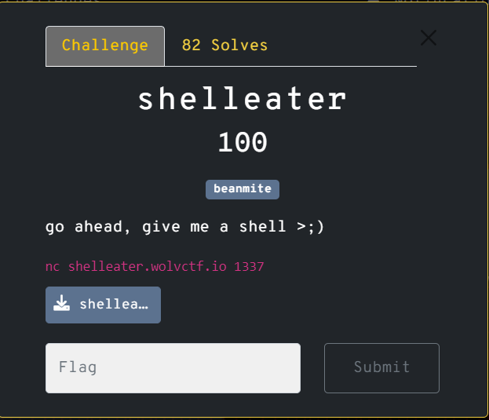
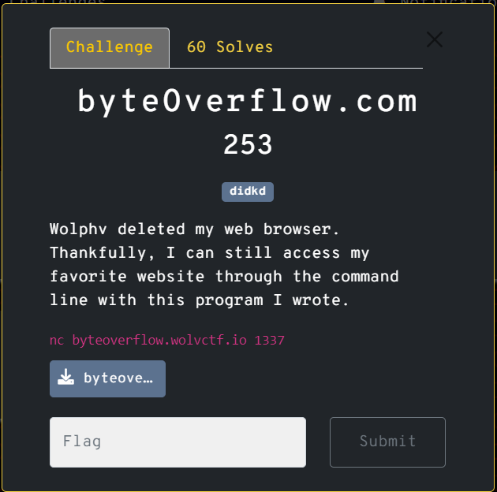
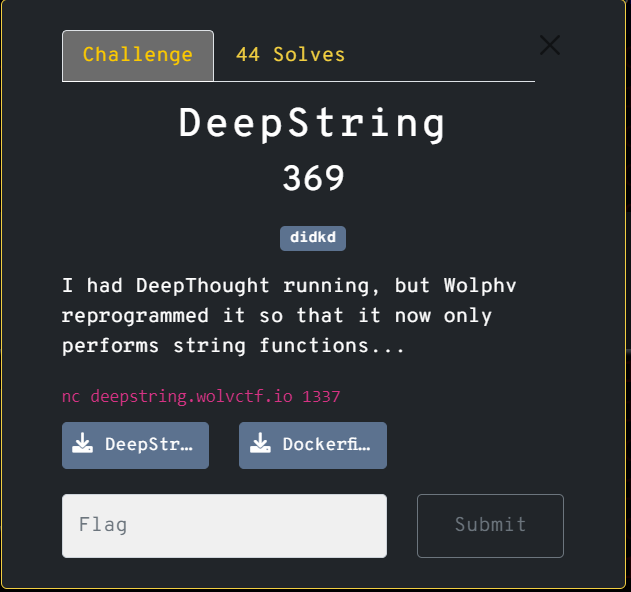
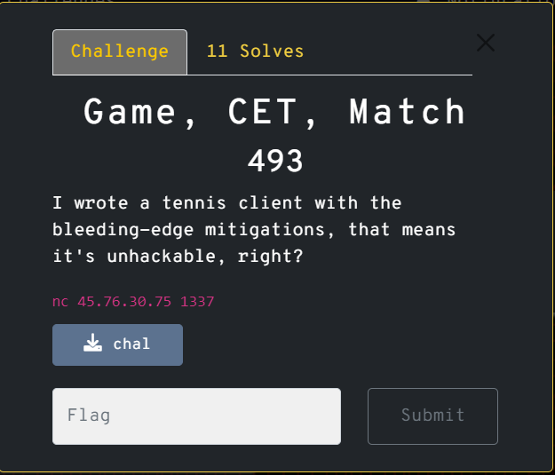
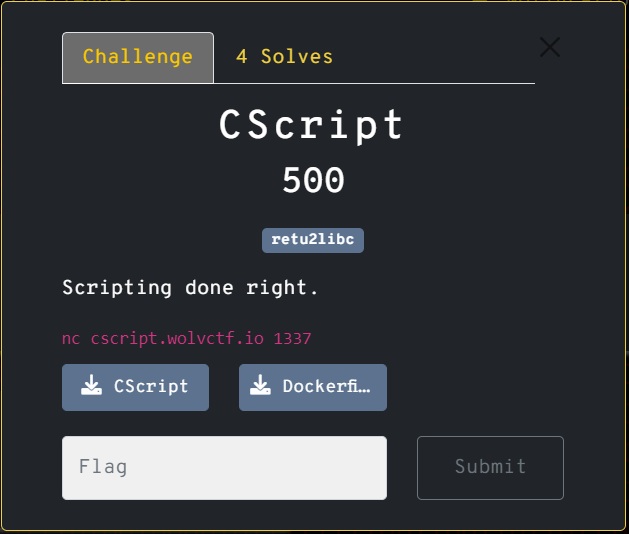
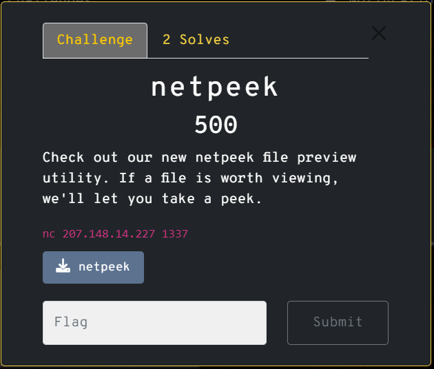

| Category    | Challenge Name   | Descripiton   | Technique    | Huntik Writeup   | Alternative Solution   |
| ----------- | ---------------  | ------------  | ------------ | ---------------- | ---------------------- |
| Cryptography      | Limited 1      |    | Bruteforce Weak Random         | [Limited 1](./Cryptography/Limited%201/Writeup.md)           | [Limited 1](https://blog.lightender.fr/writeups/wolv_ctf_2024#limited1)              |
| Cryptography   | Limited 2             |    | Bruteforce the seed in the given range and replicate the given algorithm       | [Limited 2](./Cryptography/Limited%202/Writeup.md)           | [Limited 2](https://blog.lightender.fr/writeups/wolv_ctf_2024#limited2)
| Cryptography   | Blocked 1             |    | AES CBC Bit shifting        | [Blocked 1](./Cryptography/Blocked%201/Writeup.md)           | [Blocked 1 - Short version](https://blog.lightender.fr/writeups/wolv_ctf_2024#blocked1)
| Cryptography   | Blocked 2             |    |        | [Blocked 2]           | [Blocked 2](https://blog.lightender.fr/writeups/wolv_ctf_2024#blocked2)
| Cryptography   | Tag Series 1          |    |        | [Tag Series 1]           | [Tag Series 1](https://blog.lightender.fr/writeups/wolv_ctf_2024#tagseries1)
| Cryptography   | Tag Series 2          |    |        | [Tag Series 2]           | [Tag Series 2]
| Cryptography   | Tag Series 3          |    |        | [Tag Series 3]           | [Tag Series 3](https://blog.lightender.fr/writeups/wolv_ctf_2024#tagseries3)
| Web   | Bean Cafe          |    |        | [Bean Cafe]           | [Bean Cafe]
| Web   | Upload Fun          |    |        | [Upload Fun]           | [Upload Fun]
| Web   | Username          |    |        | [Username]           | [Username]
| Web   | Order Up 1          |    |        | [Order Up 1]           | [Order Up 1]
| Pwn   | shelleater          |    |        | [shelleater]           | [shelleater]
| Pwn   | byteOverflow.com          |    |        | [byteOverflow.com]           | [byteOverflow.com]
| Pwn   | DeepString          |    |        | [DeepString]           | [DeepString]
| Pwn   | Game, CET, Match          |    |        | [Game, CET, Match]           | [Game, CET, Match]
| Pwn   | CScript          |    |        | [CScript]           | [CScript]
| Pwn   | netpeek          |    |        | [netpeek]           | [netpeek]
